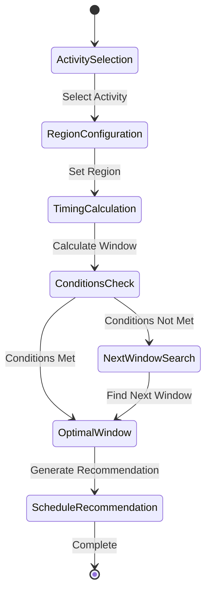

# State Flow - Lawn Care Timing Calculator

## Business State Diagram

## State Definitions
- **ActivitySelection**: User chooses which lawn care activity to schedule (seeding, fertilizing, etc.)
- **RegionConfiguration**: System determines or user selects regional climate zone
- **TimingCalculation**: Core calculation of optimal timing window based on activity and region
- **ConditionsCheck**: Validation of current temperature and seasonal conditions
- **OptimalWindow**: Successful identification of suitable timing window
- **NextWindowSearch**: Finding the next available optimal timing when current conditions don't match
- **ScheduleRecommendation**: Final output with timing guidance and temperature requirements

## Transitions
- **ActivitySelection → RegionConfiguration**: Activity type influences regional timing differences
- **RegionConfiguration → TimingCalculation**: Regional data enables specific window calculation
- **TimingCalculation → ConditionsCheck**: Window calculated, now verify current conditions
- **ConditionsCheck → OptimalWindow**: Current month and temperature within optimal range
- **ConditionsCheck → NextWindowSearch**: Current conditions outside optimal parameters
- **NextWindowSearch → OptimalWindow**: Future optimal window located
- **OptimalWindow → ScheduleRecommendation**: Generate actionable timing advice